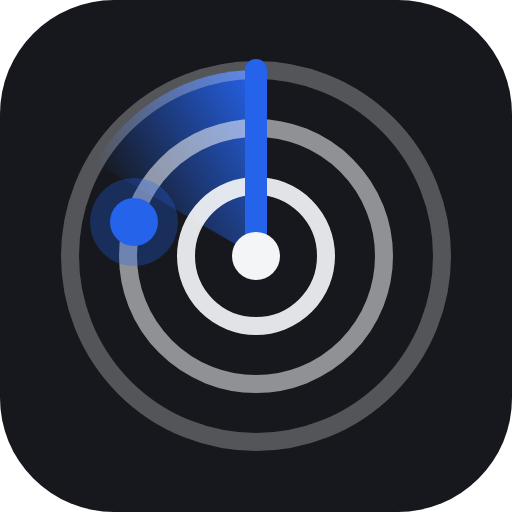
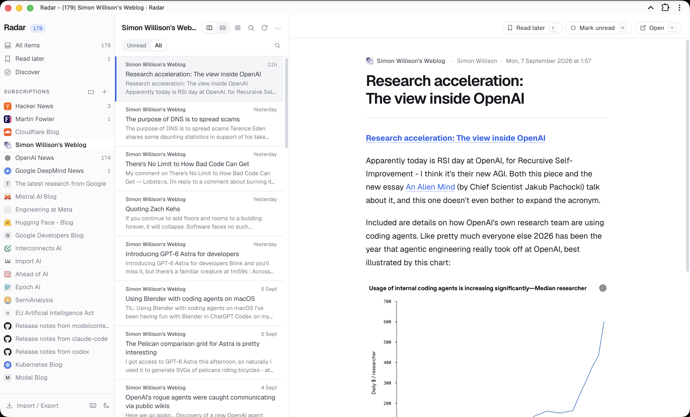

<p align="center">
  
</p>

<h1 align="center">Radar</h1>

<p align="center">
  <strong>A keyboard-first feed reader for one person.</strong><br>
  Run it on a server, or install it on your desktop. Same reader, same data model, one codebase.
</p>

<p align="center">
  
  
  
  
  
  
</p>

<p align="center">
  <a href="#two-ways-to-run-it">Two ways to run it</a> ·
  <a href="#quick-start">Quick start</a> ·
  <a href="#keyboard">Keyboard</a> ·
  <a href="#discover">Discover</a> ·
  <a href="#agents-mcp">Agents</a> ·
  <a href="#architecture">Architecture</a> ·
  <a href="#configuration">Configuration</a>
</p>

<br>

<p align="center">
  
</p>

<br>

Radar is what Google Reader would be if it were built today: dense, quick, and entirely
driven from the keyboard. It is single-user by design — no accounts, no sign-in screen.
Under the hood it is an [Effect v4](https://effect.website) backend in a hexagonal
architecture, which is why the same reader can be driven by a browser, a desktop window,
an HTTP API or an MCP client without four implementations.

## Two ways to run it

|  | **Server** | **Desktop** |
| --- | --- | --- |
| **What it is** | Deployed behind a private reverse proxy, used in the browser or installed as a PWA | A local-first app for macOS, Windows and Linux |
| **Where the data lives** | On the server, in SQLite | On your machine, in SQLite |
| **Reach it from** | Every device you own | The machine it is installed on |
| **Authentication** | Your reverse proxy — Radar has none of its own | None needed; it listens on loopback only |
| **Agents (MCP)** | `https://<instance>/mcp`, authenticated by your platform | `http://127.0.0.1:8787/mcp`, with a token the app generates |
| **Start with** | `bottle app deploy` or the `Dockerfile` | `pnpm desktop:package` |

They are the same application: identical domain, use cases and adapters, differing only in
which composition root starts them and where the database file sits. The desktop app runs
the entire backend inside Electron's main process — SQLite comes from `node:sqlite`, which
is part of the runtime Electron already ships, so there is no native module to rebuild and
no separate server to install.

They do not sync with each other. Pick the one that matches how you read: one machine, or
all of them.

## Highlights

<table>
<tr>
<td width="50%" valign="top">

**Reads everything.**
RSS 2.0, Atom, RSS 1.0 and JSON Feed. Paste a site URL and autodiscovery finds the feed.
Background refresh uses conditional requests, so publishers are asked *whether* there is
news, not for all of it again.

</td>
<td width="50%" valign="top">

**Discover, properly.**
Live search over millions of feeds with reader counts, posting cadence and icons on every
result — the directory experience Feedly used to have. Preview the latest posts before
you commit.

</td>
</tr>
<tr>
<td valign="top">

**Built for the keyboard.**
`j`/`k` through entries, `s` to save, `m` to toggle read, `v` to open the original,
`g a`/`g s`/`g d` to jump around. Every shortcut is shown on its button on desktop, so
learning it is a side effect of using it.

</td>
<td valign="top">

**Two layouts, one taste.**
Split view with a reading pane or an expanded single column, a compact row density, and
light and dark themes on cool neutrals with a blue accent. All remembered.

</td>
</tr>
<tr>
<td valign="top">

**Installable and offline.**
A PWA with a hand-written service worker: the shell is precached, and feeds and articles
you have opened are there when the network is not. Responsive from a 320px phone to a
wide desktop.

</td>
<td valign="top">

**Open to agents.**
Fourteen MCP tools over Streamable HTTP — list, read, triage, subscribe, search the
directory — on the same application services the UI uses. Authenticated by your
platform's token, or by one of its own.

</td>
</tr>
</table>

Also: folders, unread counts, read later, full-text search over what you have, OPML
import and export.

## Quick start

### Run it locally

```sh
pnpm install
pnpm dev            # API on :8080 (tsx watch) + Vite on :5173 proxying /api
```

Then open <http://localhost:5173>, press `a`, and paste a URL.

```sh
pnpm test           # server unit + adapter tests (vitest)
pnpm typecheck
pnpm build          # web/dist + server/dist
pnpm start          # serves the API and the built client on $PORT (default 8080)
```

### Run the desktop app

```sh
pnpm install
pnpm desktop                # build everything, then launch the Electron app
pnpm desktop:package        # installers in desktop/release for the current OS
```

Data lives in Electron's per-user directory — `~/Library/Application Support/Radar` on
macOS, `%APPDATA%\Radar` on Windows, `~/.config/Radar` on Linux — with **File → Open data
folder** to get there. **File → Copy MCP endpoint** puts the local URL and its token on the
clipboard, which is all a local agent needs.

Packaged builds are unsigned by default, so macOS asks you to confirm on first launch
(right-click → Open) and Windows shows a SmartScreen notice. Signing is configuration, not
code: add `mac.identity` and a `CSC_LINK` for Windows in `desktop/electron-builder.yml`.
The Apple side needs a paid Developer account before notarization will work at all.

### Run the image

```sh
docker build -t radar .
docker run -p 8080:8080 -v radar-data:/app/data radar
```

### Deploy to Cloud in a Bottle

`cloudinabottle.toml` and the multi-stage `Dockerfile` are ready. The CLI deploys from a
git repository, so push this one somewhere your instance can reach first:

```sh
bottle instance login                                # interactive, one time
bottle app deploy <git-url> --name radar --wait
bottle app logs radar --follow
```

Radar listens on `8080`, keeps its database under `BOTTLE_APP_DATA_DIR`, answers the
router's health check at `/api/health`, and relies on the router's owner authentication —
no path is public.

## Keyboard

Press `?` inside the app for the same list.

| Navigate | | Act | | Manage | |
| --- | --- | --- | --- | --- | --- |
| `j` `↓` | Next item | `m` | Toggle read | `c` | Compact rows |
| `k` `↑` | Previous item | `s` | Save for later | `1` | Expanded view |
| `space` | Scroll article, then next | `v` | Open original | `2` | Split view |
| `J` `]` | Next subscription | `A` | Mark all as read | `a` | Add subscription |
| `K` `[` | Previous subscription | `r` | Refresh feeds | `e` | Edit subscription |
| `g a` | All items | `u` | Unread only | `/` | Search |
| `g s` | Read later | | | `?` | Shortcuts |
| `g d` | Discover | | | `esc` | Close / clear |
| `o` `enter` | Focus the article | | | | |

## Discover

Search runs against `cloud.feedly.com/v3/search/feeds` — the index behind Feedly's own
search box. It answers with reader counts, posts per week and an icon, which is what makes
a stranger's feed judgeable before subscribing. No account or key: this is the endpoint
Feedly leaves open. It is also undocumented, so the adapter treats every failure as
expected — results are cached for fifteen minutes, a changed field costs one result rather
than the search, and when the directory cannot be reached at all a bundled catalog of
about forty feeds answers instead and the client says so.

Two consequences worth knowing. Search terms leave your instance: a query is sent to
Feedly with nothing else — no account, no cookie, no subscription list. And the directory
is someone else's service, so `FeedDirectory` is a port like any other; swapping in a
different index, or one that never leaves the machine, is a change in the composition
root and nowhere else.

## Agents (MCP)

Radar speaks the [Model Context Protocol](https://modelcontextprotocol.io) at `/mcp`
(Streamable HTTP). It is a driving adapter over the same application services as the
HTTP API — no separate data path, no separate rules.

Tools: `list_feeds`, `list_entries`, `get_entry`, `get_stats`, `list_categories`,
`mark_read`, `mark_all_read`, `set_saved`, `subscribe`, `unsubscribe`, `discover_feeds`,
`browse_catalog`, `search_feeds`, `refresh`. `get_entry` returns article text with the
markup stripped, which is what an agent actually wants to read.

### Connecting

Who authenticates the caller is set by `MCP_AUTH`, and the right answer differs on and off
a Cloud in a Bottle instance.

**On an instance — let the platform do it (`MCP_AUTH=router`, what the image ships).**
Every route of a non-public app already requires the owner, and that means an API token
as much as a browser session. So an MCP client needs no login:

```sh
bottle tokens create --name radar-mcp --expiry-hours never
```

Point a client at `https://<your-instance>/mcp` with that token as
`Authorization: Bearer <token>`. `/mcp` stays out of `public_paths`, so it is never
exposed to the internet, and there is no second secret to manage.

In this mode Radar does not check a token of its own. It cannot: there is one
`Authorization` header, and by the time the request arrives it carries the router's token —
a second check could only reject a caller the owner already approved. Which is why the
mode holds *only* while `/mcp` is behind the login. So the server reads
`cloudinabottle.toml` at startup, and if `public_paths` covers `/mcp` it refuses router
mode and falls back to its own token rather than serving the reader open. The manifest
cannot set environment variables, so `MCP_AUTH` lives in the `Dockerfile`.

**Locally, or behind a public path — the app's own token (`MCP_AUTH=token`).**

```sh
MCP_AUTH=token MCP_TOKEN=$(openssl rand -hex 32) pnpm start
```

The endpoint is served only when a token is configured; with none there is nothing to
authenticate with, so the route answers 404 rather than serving Radar open. Tokens are
compared in constant time. On a deployed instance the token comes from the secrets
service: `cloudinabottle.toml` asks the owner to grant `READER_MCP_TOKEN`, and the server
fetches it at startup through `$BOTTLE_ROUTER_URL/api/services/v2/call/secrets/get`. The
granted secret wins over `MCP_TOKEN`. This is the mode to use if you ever add `/mcp` to
`public_paths` — deliberately not the default, because it moves the endpoint out from
behind the router's authentication and leaves one token in front of everything.

## Architecture

```
server/   Effect v4 backend, hexagonal
  src/domain           entities, value objects, errors, and ports (interfaces only)
  src/application      use cases: SubscriptionService, RefreshService, EntryService, …
  src/adapters
    inbound/http       HttpApi definition + handlers            (driving)
    inbound/mcp        MCP tools over Streamable HTTP           (driving)
    inbound/scheduler  periodic refresh                         (driving)
    outbound/sqlite    repositories over node:sqlite            (driven)
    outbound/feed      HTTP fetcher, parser, autodiscovery      (driven)
    outbound/directory Feedly feed search                       (driven)
    outbound/catalog   bundled Discover catalog                 (driven)
    outbound/opml      OPML codec                               (driven)
    outbound/secrets   Cloud in a Bottle secrets service        (driven)
    outbound/system    id generation                            (driven)
  src/infrastructure   composition root: config + layer wiring
  test/                in-memory adapters, application and adapter tests
web/      Vite + React 19 client, TanStack Query, hand-written service worker
desktop/  Electron main process: the second composition root
  src/main.ts   window, menu, data directory, and the embedded server
  src/port.ts   picks a stable port, so the origin — and its localStorage — survives
  build.mjs     bundles the main process and the server into one file with esbuild
```

Every port is an Effect `Context.Service`; every adapter is a `Layer`. The application
layer depends on ports only, and `infrastructure/AppLayer.ts` is the single place that
decides which adapter satisfies which port — which is exactly why a desktop build costs a
new entry point rather than a second implementation: `desktop/src/main.ts` calls the same
`makeAppLayer`, with a different data directory and a loopback address. Tests swap in
`test/support/InMemoryAdapters.ts` and exercise the real use cases without SQLite or the
network.

OpenAPI is served at `/api/openapi.json`. The main endpoints:

- `GET/POST /api/feeds`, `PATCH/DELETE /api/feeds/:id`, `POST /api/feeds/:id/refresh`
- `GET/POST /api/categories`, `PATCH/DELETE /api/categories/:id`
- `GET /api/entries?feed=&category=&unread=&saved=&q=&cursor=`, `GET /api/entries/:id`
- `POST /api/entries/mark`, `POST /api/entries/mark-all`, `PUT /api/entries/:id/saved`
- `GET /api/stats`, `POST /api/refresh`, `GET /api/discover?url=`, `GET|POST /api/opml`
- `GET /api/catalog`, `GET /api/catalog/search?q=`, `GET /api/catalog/:id/preview`

## Configuration

| Variable | Default | Purpose |
| --- | --- | --- |
| `PORT` / `HOST` | `8080` / `0.0.0.0` | Listen address |
| `DATA_DIR` | `$BOTTLE_APP_DATA_DIR` or `./data` | Persistent directory |
| `DATABASE_PATH` | `$DATA_DIR/radar.db` | SQLite file |
| `STATIC_DIR` | `../web/dist` | Built client to serve |
| `REFRESH_INTERVAL_MINUTES` | `15` | Background refresh cadence |
| `MCP_AUTH` | `token` | `router` trusts Cloud in a Bottle to authenticate `/mcp`; `token` makes Radar the only gate. The image ships `router`. |
| `MCP_TOKEN` | — | Bearer token for `/mcp` in `token` mode. On an instance the granted `READER_MCP_TOKEN` secret wins. |
| `HTTP_PROXY` / `HTTPS_PROXY` / `NO_PROXY` | — | Honoured for every outbound fetch |

## Notes

- **Docker.** The image is Debian-based on purpose: `effect` depends on `msgpackr`, whose
  optional native accelerator only ships glibc prebuilds, so an Alpine build would try to
  compile it from source and fail.
- **Build resources.** Building needs far more memory than running: `pnpm install` peaks
  around 604 MB and `tsc` around 584 MB, against roughly 185 MB for the running server.
  `build_memory_mb` in `cloudinabottle.toml` defaults to `memory_mb`, so it is set
  explicitly; too low a value shows up as a build killed with exit status 137.
